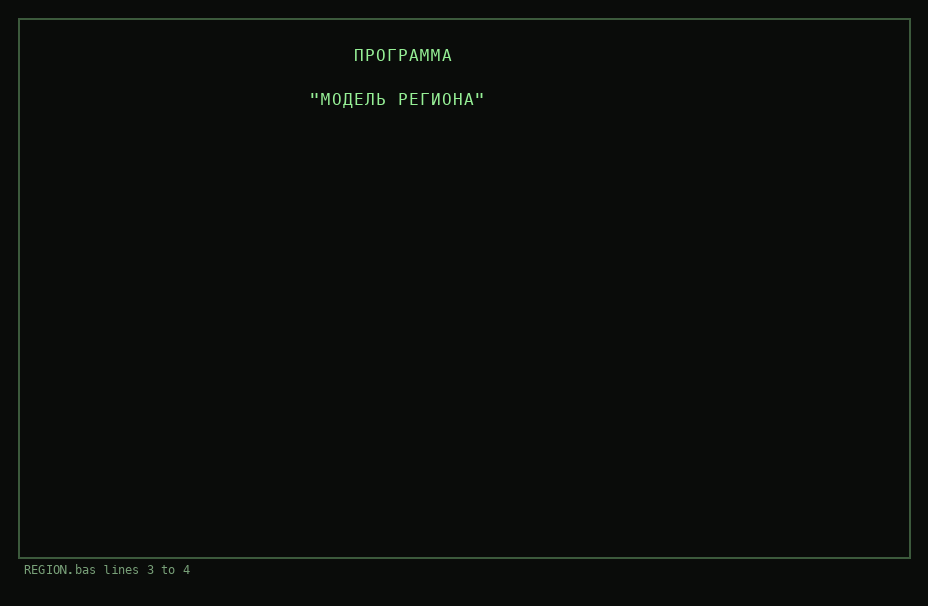
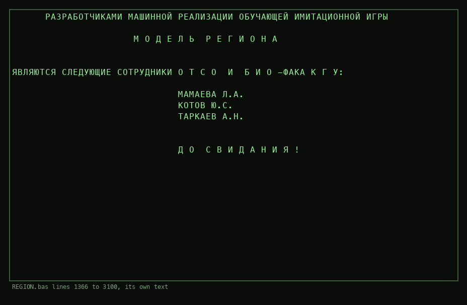
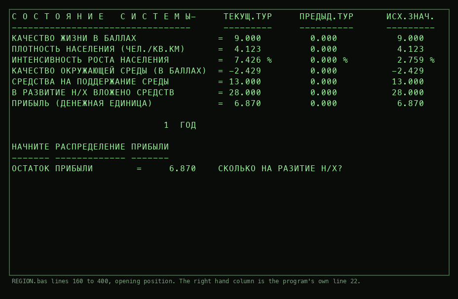
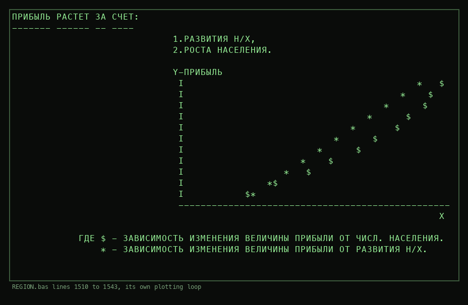
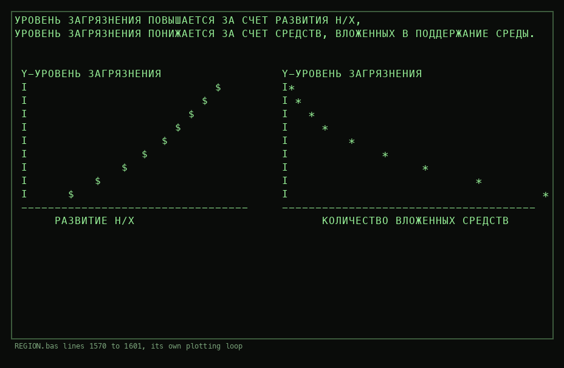
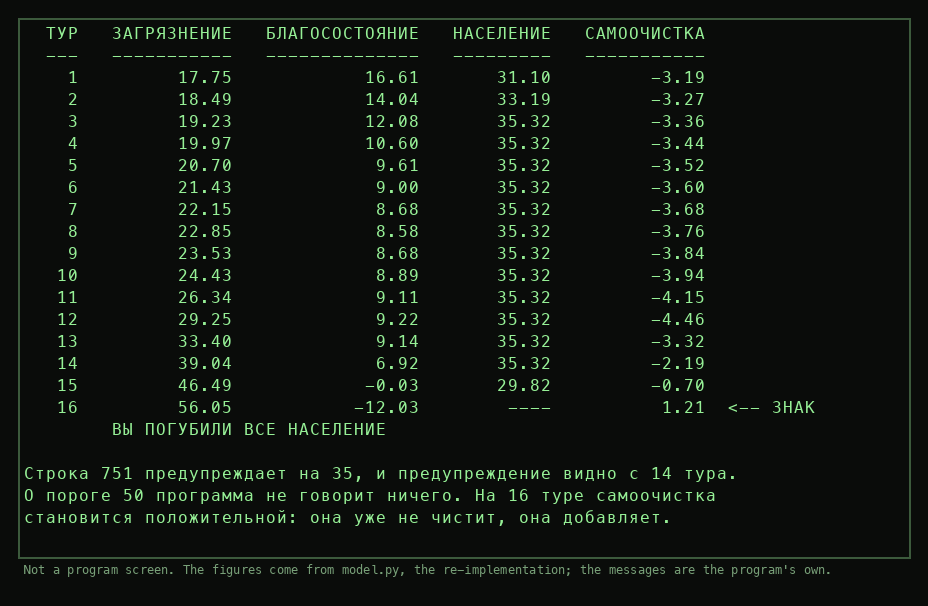

# МОДЕЛЬ РЕГИОНА

A Soviet teaching game about running a region for 25 years, written in
BASIC for the Iskra-226. The player divides the profit between the
economy, the environment, the standard of living and birth control, and
the model answers.

It has a point of no return built into it. Above a pollution of 50 the
term that cleans the environment changes sign and starts adding instead.
Nothing in the program says so.



## What this is

420 lines of BASIC. It has no date and no `REM` line anywhere, and for a
while I said it had no author either. It does. The credits are at line
1366, behind a door almost nobody opens: you have to finish all 25 turns
and then decline to play again.



The developers of the machine realisation of the teaching simulation game
МОДЕЛЬ РЕГИОНА are the following staff of ОТСО and the biology faculty of
KGU: Mamaeva L. A., Kotov Yu. S., Tarkaev A. N.

Two of the three are identifiable and the university is Kazan. That took
a second round of research and it is written up further down, under
[Who made it](#who-made-it). Read the wording here carefully all the
same: they are named as developers of the *machine realisation*, the
same phrase the title screen uses, and that turns out to be exactly
right.

The program names itself in lines 3 and 4 and then gets on with it. It
states its goal only once, in line 597, and it does so while telling the
player off:

> ВАША ЦЕЛЬ - ВЫСОКОЕ КАЧЕСТВО ЖИЗНИ ПРИ У М Е Л О М УПРАВЛЕНИИ
> СИСТЕМОЙ В ЦЕЛОМ

A high quality of life under skilful management of the system as a
whole. The spaced out letters are in the original. Whoever wrote this
wanted the word *skilful* read slowly. Line 1140 calls the thing an
имитационная система, a simulation system, which is what its developers
took themselves to be building.

## How it plays

You run a region for 25 years and the machine argues with you about it.
It shows numbers, takes four inputs, and works out what your decisions
did.

On the first start it announces itself, and the wording is worth
noticing:

> **МАШИННАЯ РЕАЛИЗАЦИЯ ОБУЧАЮЩЕЙ ИМИТАЦИОННОЙ ИГРЫ**

The machine realisation of a teaching simulation game. The word
*realisation* points at something that existed before the computer did.
Then it offers the rules and describes itself as practice in acquiring
skills in the management of complex systems.

After that the same cycle, 25 times.

**The state.** Seven readings in three columns: this turn, last turn,
and the value you started from. Quality of life, population density,
growth rate, environmental quality, money spent on the environment,
money invested, profit. So you see at a glance whether you improved
since the last move and how far you have drifted from where you began.

**The allocation.** You have a profit and you spend it. Four questions in
order, each showing what is left:

* how much to the national economy
* how much to keeping the environment
* how much to quality of life
* how much to birth control, at most one unit, and the only one that
  also takes a negative number

What you do not spend is not lost, it stays as profit. Once per turn you
may take it all back and divide it again. If you try to shrink the
economy, the program refuses.

**The answer.** Your investment makes dirt. Dirt lowers environmental
quality, that lowers prosperity, and the rising population density lowers
it further. At the same time prosperity raises the population. Two loops
pulling against each other, both delayed, and prosperity decays on its
own if you stop feeding it.

**It interrupts constantly.** In turn 1 it explains that negative numbers
mean a bad state and positive ones a good state. Through the first twelve
turns it offers to show you how the system hangs together, and then draws
four curves on the text screen with `PRINT`, `TAB` and a `FOR` loop.
Fixed messages fire in turns 2, 4, 8, 13 and 20, among them
*ВЫ НЕДООЦЕНИВАЕТЕ ПАГУБНОЕ ВЛИЯНИЕ ЗАГРЯЗНЕНИЯ ОКРУЖАЮЩЕЙ СРЕДЫ*, you
are underestimating the ruinous effect of pollution.

**The ending.** Each turn adds your prosperity surplus to a running
total, and the final mark decides which of six speeches you get. From 18
up it is one word, **П Р Е К Р А С Н О !**. From 16 to 18,
**О Т Л И Ч Н О !** with congratulations. From 14 to 16 it says your
work can be rated excellent and that you have learned to manage the
system, but that you still do not trust yourself and should be more
decisive. Below 5 the lesson comes in plain words: you must learn to
think about the future and to take the interactions between the elements
of the system into account.

Answer no when it asks whether you want another game, and it prints its
credits and says goodbye.

### What it is actually about

Growth alone loses, reliably. Put everything into the economy and you are
finished in four turns, because prosperity falls under the threshold of
12 and the population then collapses exponentially. Tend only the
environment and you have nothing to live on. The program names its own
victory condition and it is not production, it is skilful management of
the whole.

Underneath that sits the thing it never mentions. Above a pollution of
50 the self cleaning term turns positive and the dirt becomes its own
source. It warns at 35. At 50 it says nothing.

## The second level, and what 1985 looks like from inside

After turn 5 it asks whether you think you could handle a more
complicated system. Say yes and it switches on random events.

The randomness is not random. It is the fractional part of the last
quality of life reading, `Y3 = A1 - INT(A1)`, sorted into thirteen
buckets. A deterministic draw out of the model's own state, which is
either a clever trick or the only one available on a machine with no
random number source the author trusted.

The events themselves are the period talking:

> НАГНЕТАНИЕ МЕЖДУНАРОДНОЙ НАПРЯЖЕННОСТИ ИМПЕРИАЛИСТИЧЕСКИМИ
> ГОСУДАРСТВАМИ И НЕОБХОДИМОСТЬ ОТВЕТНЫХ МЕР ПРИВЕЛО К ТОМУ, ЧТО ЧАСТЬ
> БЮДЖЕТА ПЕРЕДАНА ВОЕННЫМ ВЕДОМСТВАМ.

The stoking of international tension by the imperialist states and the
necessity of countermeasures has meant that part of the budget has gone
to the military departments. You lose two units of profit in each of the
last two turns.

Next to it: a hurricane that costs the economy five units, universal
environmental education and effective propaganda in environmental
protection that raise prosperity by two and hand you an extra unit of
profit, and environmental legislation that works, bringing closed
production cycles and cutting effluent.

That is the shape of the thing. A student at a Soviet institution sits
down at an office computer and is taught, by the machine, that
production has a cost that comes back at you, that the environment can
pass a point it does not return from, and that the arms race takes money
out of the same pocket as the rest. The programmer put all three in the
same program and let the student lose.

**When.** The game itself carries no date. The diskette does: `SIG`
version 1.4 of 18 October 1985 is on the same side, built against BASIC
02 of 30 September 1984, and `MANAGEM` next to it is dated 28 April
1983. So the side as assembled cannot be older than October 1985. That
dates the diskette, not the game on it.

## Where it came from

Side `012 1` of the Iskra-226 diskette archive. The side carries no
catalog, which is why it sat unread for a while: `iskra.py` looks for a
Wang style directory in sector 0, finds nothing that parses, and reports
the side as unknown. That verdict was wrong twice over. The side is
readable and it is full.

What is on it is the output of BASIC's own `LIST DC` statement, source
text written straight to the surface with no directory in front of it.
REGION line 2 is the author's own tooling for exactly that, and line 1
jumps over it so it never runs by accident:

```
1 GOTO 3
2 SCRATCH R/1C,"REGION":SAVE DC R/1C,T("REGION")"REGION":LIST DC R/1C,"R":END
```

`listing_format.py` in this folder reads and writes that layout. The
format is in its docstring. The short version: a header sector `01`
followed by an eight byte name, then text sectors prefixed `02 80`,
`8F 80` and `03 80` for first, middle and last, lines separated by `85`,
an end record `1C 00 78`, and no line ever split across a sector.

The original side is `disks/012-1.dsk`, here with dk_spb's permission.
`region.dsk` in this folder is a side carrying only REGION, built by that
writer from `REGION.bas`. Its sectors 0 to 119 are byte for byte the same
as sectors 203 to 322 of the original, which anyone with this repository
can check:

    python3 listing_format.py names ../disks/012-1.dsk
    python3 listing_format.py read  ../disks/012-1.dsk REGION | diff - REGION.bas
    python3 listing_format.py write /tmp/rebuilt.dsk REGION REGION.bas

The point of keeping both is that the second one is a test. If the writer
is wrong about the format, the rebuild stops matching.

## The screens

The opening position. The right hand column is not computed at run time,
it is stored in line 22 as the reference the player is measured against.



The program teaches while it plays. In the first twelve turns it offers
to explain itself, and the explanations are plots, drawn with `PRINT`,
`TAB` and a `FOR` loop. Profit against the economy and against
population:



Pollution against production on the left, against money spent on the
environment on the right. Two curves of different shape, side by side on
an 80 column screen, in 1980s BASIC:



## The state, and what the player can touch

Six variables, set in line 10.

| | start | |
|---|---:|---|
| `P1` | 28 | invested in the national economy |
| `B1` | 13 | spent on keeping the environment |
| `G1` | 20 | prosperity, from which quality of life follows |
| `Z1` | 17 | pollution |
| `H1` | 29 | population |
| `K1` | 2 | birth control |

Each turn the player divides the profit four ways. Three of the four
levers only take money. Line 413 refuses to let the economy shrink:
*СОГЛАСИТЕСЬ, ЧТО СВЕРТЫВАТЬ РАЗВИТИЕ Н/Х НЕЦЕЛЕСООБРАЗНО*, agree that
winding down the national economy is not expedient. Birth control is the
only lever that works in both directions, and it is capped at one unit
per turn.

Money not spent stays as profit. Once per turn the allocation can be
taken back and done again, line 703.

## The feedbacks

Lines 708 to 790, in the order the program runs them.

```
K1 <- K1 + birth control
B  <- 1 - B1^1.5 / 20          effect of the environment money
Z1 <- Z1 + B + P               P is pollution from production
Z1 <- Z1 + C                   C is self cleaning
G1 <- G1 + Z + L               environment and density hit prosperity
G1 <- G1 + G                   prosperity decays on its own
```

Pollution from production doubles its slope once the economy passes 45,
lines 1280 to 1300. Prosperity drifts toward the threshold of 12 with no
help from anyone, lines 1230 to 1240, so a region left alone slides. And
below a prosperity of 12 the population does not decline, it falls off a
cliff: line 820 is `A8 = -3^(1-G1) * H1/20`, an exponential whose
exponent grows the further prosperity drops.

Two loops run against each other, both delayed. Investment makes profit,
profit allows investment, investment makes dirt, dirt lowers the
environment, the environment lowers prosperity. At the same time
prosperity raises the population, the population raises the density, and
the density lowers prosperity again.

## The threshold at 50

Self cleaning, lines 1250 to 1270:

```
Z1 <  0    C = 2^Z1                                practically nothing
0 <= Z1 <30 C = -(Z1^2 + 45*Z1 + 250)/(10*Z1+250)  nature cleans
Z1 >= 30   C = -(50 - Z1)/5
```

The third branch is the one that matters. At a pollution of 30 the term
returns minus four per turn. At 45 it returns minus one. At 50 it is
exactly zero, and above 50 it is positive, which means it no longer
cleans, it adds. Past that point the pollution is its own source and no
amount of money brings it back.

    python3 model.py

The program warns at 35 and says nothing at all at 50. Here is a run
that gets there, twenty percent of the profit to the economy, ten to the
environment, the rest to quality of life. The last column is `C`:



Sixteen turns. The warning appears at turn 14, the sign changes at turn
16, and by then the population is gone. A player watching the screen
sees the warning; the number that decides the outcome is never printed.

Two things should be said against overreading this. The threshold is
often unreachable in practice because prosperity collapses first and
ends the game earlier, which is what happens if you put everything into
the economy. And the model has no floor under pollution: spend heavily
enough on the environment and `Z1` runs away downward without limit,
which is as unphysical as it sounds. This is a teaching model of 1980s
vintage, not a defensible simulation, and its interest is in what it
chose to represent.

## Two more things it does to you

**No praise you can rest on.** The 14 to 16 band tells you your work can
be rated excellent and that you have learned to manage the system, then
adds that you do not yet trust yourself, then closes with
*ПОПРОБУЙТЕ СЫГРАТЬ ЕЩЕ ЛУЧШЕ*, try to play better still. There are two
more bands above it. The scale keeps going after it has called you
excellent.

**A harder start for the second run.** Lines 27 and 28 reset the opening
position for a returning player: almost double the pollution, and two
thirds of the quality of life. `python3 model.py` builds that position
with `Region(hard=True)`.

There was a printed booklet. Line 3620 tells the player to read the guide
to the game again before starting the next one. I have not found it, and
the section on where this comes from says what that means.

## Scoring, and the clause against gaming it

Each turn adds the prosperity surplus to a running total. If the
population fell against the previous turn, three times the loss is
subtracted, line 882, which makes losing people the most expensive
mistake available.

The final mark is `(Y + 3*Y2)/M`, where `Y2` is the score of turn 17.
Turn 17 therefore counts four times over. The code does not say why, and
neither will I.

Then there is line 592. From turn 21 on, a player who pushes more than
half the profit into quality of life gets warned, and on the second
offence the mark is divided by 1.2 with the message *ВАШИ НЕЛОГИЧНЫЕ
ДЕЙСТВИЯ В КОНЦЕ ИГРЫ ПРИВЕЛИ К СНИЖЕНИЮ ОЦЕНКИ ДЕЯТЕЛЬНОСТИ*. The
author expected players to farm the objective function against the model
in the closing turns, and priced it in. That is a person who had watched
people play.

## The disk it sits on

The side is `disks/012-1.dsk`, and it is not all one thing:

| sectors | | |
|---:|---|---|
| 0 to 202 | tokenised BASIC 02, no header record | carries the header line of the `SIG` package, version 1.4 of 18 October 1985 |
| 203 | `REGION` | this game, listing |
| 323 | `SNAKE` | the snake game, listing, arrow keys on 4 6 8 5 |
| 343 | `MANAGEM` | a second business game, listing, and this one is signed |
| 450 | `SIG1` | not a listing, and the header flag byte says so |
| 668 to 680 | a short tail | |

The four names above are the members that carry an `01` header record.
The material at the front has none, which is why a reader that looks only
for headers reports four programs and a reader that looks at the bytes
finds more.

The header line in that front material is worth reading twice:

```
++++++  В.С.ЮЩЕНКО В.В.ПАРХАЕВ Ю.В.КАЗАКЕВИЧ  ++++++
        ВЕРСИЯ 1.4  18.10.85    BASIC 02 30.09.84
```

Yushchenko, Parkhaev and Kazakevich. The same side that carries a
teaching game about the limits of growth also carries a function and
graphics package by three named people from the Institute of Physical
Chemistry. Whoever assembled this diskette was not sorting by
subject.

`MANAGEM` line 10 is a comment, and it is the only attribution that sits
in plain sight rather than behind a screen you have to earn:

```
10 REM MANAGEM.01/28.04.83/ГОРПЕНКО/ДЕЛОВАЯ ИГРА
```

A business game, version 01, 28 April 1983, by Gorpenko. It is a market
simulation for up to twenty players with monthly cycles, raw material
bids, fixed costs, market conditions and random emergencies. Its
subroutine comments are in Russian throughout.

So the side is a teaching set of business games, and one of the two is
dated to April 1983. Elsewhere in the same archive, side `w006-s1`
carries `PRESID`, a third one. `МОДЕЛЬ РЕГИОНА` names its programmers
only in the credits screen almost no player reached.

The header flag byte is `0x20` on the three listings and `0x21` on
`SIG1`, whose sectors are not text. One byte, one bit, and the reader
knows whether to expect source.

## Who made it

<a id="who-made-it"></a>

`КГУ` is **Казанский государственный университет**, Kazan State
University. That is not read off the abbreviation, which fits nine
universities. It follows from two of the three names in the credits
being documented staff of that one institution, in the right faculties,
in the right years.

### Tarkaev, who did the machine

**Александр Никитич Таркаев**, Alexander Nikitich Tarkaev, 1947 to 2009.
A radiophysicist, KGU graduate of 1971, and from 1977 the head of the
university's **лаборатория технических средств обучения**, the laboratory
for technical teaching aids. That is what `ОТСО` almost certainly stands
for, `отдел технических средств обучения`, the standard name for such a
unit at Soviet universities.

He was one of the people who brought computer aided teaching to the
Soviet Union. His laboratory started building computer courses in 1978,
had the university's first display classrooms running in 1983 and about
fifty courses in use, and in 1984 he took the **Prize of the Council of
Ministers of the USSR** for creating and introducing computer based
automated teaching systems. By 1986 KGU counted among the three leading
centres for computer aided learning in the country. In 1988 he folded
the laboratory into a new computing centre and directed it.

Then this, which dates and places the whole thing without needing the
program at all:

> 1987. За работы по экологическому моделированию коллектив
> А. Н. Таркаева вновь награжден серебряной и пятью бронзовыми медалями
> ВДНХ СССР.

In 1987 Tarkaev's collective was awarded one silver and five bronze
medals at the USSR exhibition of economic achievements **for work on
ecological modelling**. Six medals means at least six people. This
program is one of the things that group was making in those years.

In 1989 he went to Dartmouth College as a research intern in the
computer modelling of ecological systems. Afterwards he left the
university, co-founded one of the first Soviet joint venture computer
firms, and ended up a Tatarstan politician and head of the republic's
chamber of commerce for seventeen years. He died of a heart attack in
2009.

### Kotov, who did the ecology

**Юрий Степанович Котов**, Yuri Stepanovich Kotov, candidate of
biological sciences. From 1986 he headed KGU's **кафедра охраны
природы**, the nature conservation chair, which had been founded in 1969
as the first of its kind in the Soviet Union. In June 1989 that chair
became the **first ecological faculty in the USSR** and Kotov was its
founding dean until 1994. He then went to Ulyanovsk and built another
ecological faculty there.

His field was water toxicology and the ecology of the Kazan lakes. And
this is the sentence that puts the program in its place, from a 2015
paper by Popova, Taranets and Pikulenko of Moscow State University:

> В середине и в конце 1980-х годов лидером по разработке имитационных
> экологических игр становятся сотрудники Казанского университета, так
> под руководством Ю. С. Котова была создана целая серия учебных
> компьютерных игр ... В основу были положены эколого-токсикологические и
> гидроэкологические исследования по спасению городских озёр г. Казани.

In the middle and at the end of the 1980s the leaders in developing
simulation games for ecology were the staff of Kazan University, where a
whole series of teaching computer games was created under Kotov's
direction. What they were built on was the eco-toxicological and
hydro-ecological research into saving the city lakes of Kazan.

So the model in this program is not a thought experiment about a generic
region. It comes out of a group that was in court over a chemical
combine's effluent and was trying to keep two real lakes alive.

### Mamaeva, who is still missing

**МАМАЕВА Л. А.** could not be identified. No first name, no patronymic,
no publication, no personnel record that can be tied to ОТСО or the
biology faculty. Given how the other two divide, the specialist and the
head of the computing unit, the reasonable guess is that she wrote the
BASIC. That is a guess and it is labelled as one. Of the three names on
this program she is the one who did the thing this repository is about,
and she is the one nobody can name.

### It is one of three

The game is not a one off. Methodical instructions for students survive
for a set of three programs: **«Малая река»** (small river), **«Озеро»**
(lake) and **«Модель региона»**. «Озеро» was later ported to the IBM PC
and ran under MS-DOS as `LAKE`.

That is the printed guide this program keeps telling the player to read,
or at least its family. Two cautions. The surviving instructions
describe the later PC versions, not this one, and they name no
developers, so they do not confirm the credits screen. And a fourth
game, «Остров», is sometimes attributed to this group but belongs to
D. N. Kavtaradze at Moscow State University.

### What this does to the dating

The credits and the award between them place the program at Kazan in the
middle 1980s, in a laboratory whose ecological modelling work was
decorated in 1987, and on a diskette that cannot have been assembled
before October 1985. Those three fit each other. None of them is a date
in the program, which still has none.

## The tradition it belongs to

Kazan and the two names answer where this came from. They do not answer
what kind of thing it is, or why a university was building it at all.

**It was never a published game in the ordinary sense.** The title is
not in library catalogues or in the bibliographies of Soviet деловые
игры, and no separate edition of it turns up anywhere. What exists is
teaching material for a set of three programs used inside a course. That
is the normal fate of this kind of work: printed in runs of a few
hundred, catalogued locally if at all, and not the sort of thing the
Soviet book register recorded. An earlier round of this research called
the whole thing a negative result. It was, until the credits screen
turned up and gave it a place to look.

**The genre is documented in detail.** The first Soviet business game,
«Пуск цеха», was developed at the Leningrad Engineering and Economics
Institute by M. M. Birstein, with the method ready at the end of 1931 and
the first session run on 23 June 1932. Its subject was bringing a
typewriter assembly shop into operation. The games were banned in 1938
and taken up again at the end of the 1960s. In 1975 the school
«Деловые игры и их программное обеспечение» was founded at Zvenigorod
near Moscow on the initiative of the Central Economics and Mathematics
Institute and the economics faculty of Moscow State University. Software
was in its title from the first day, which is the short answer to why a
game like this exists on an office machine in the 1980s.

The claim that the 1932 game was the first in the world is the movement's
own account of itself. I repeat it as that and not as a checked fact.

**The way it thinks about thresholds has a documented home.** Forrester's
*World Dynamics* appeared in Russian as «Мировая динамика» in 1978,
translated by A. Voroshchuk and S. Pegov, edited by D. M. Gvishiani and
N. N. Moiseev, with an afterword by Moiseev. Gvishiani was the route by
which the Club of Rome reached the Soviet professional public. Moiseev's
group at the Computing Centre of the Academy of Sciences modelled nuclear
winter in 1983. Feedback, thresholds and self reinforcement were ordinary
working ideas in that world. None of this connects to this program by any
document. It is the water the author swam in, not a source.

**One parallel, and it does not hold up as a source.** Frederic Vester's
*Ökolopoly* of 1980, which grew out of his earlier «Kybernetien» of 1976,
gives the player a fixed budget of action points each round to divide
among remediation, production, environmental load, education, quality of
life and population, all wired to each other. Read that list next to the
six variables above and the resemblance is hard to miss.

It does not survive checking. There is no Soviet translation of Vester,
no licence, no reprint, and no mention of him in the Soviet journals
where such a thing would have surfaced. Every Russian reference to Vester
that exists is from after 2000. What would count as evidence: a Russian
edition before 1991, a Soviet review, a methodical text naming Ökolopoly,
or a shared numerical mechanism rather than a shared shape. None of that
is present. Two people can arrive at the same small set of variables
because the variables are obvious once you decide to model a region, and
until something turns up that is the better explanation.

**It calls itself a machine implementation.** Line 3160 announces
«МАШИННАЯ РЕАЛИЗАЦИЯ ОБУЧАЮЩЕЙ ИМИТАЦИОННОЙ ИГРЫ», the machine
realisation of a teaching simulation game. That wording points at
something that existed before the computer did. If there was a board or
paper version, finding it would answer most of this section.

### On the sourcing of the above

I have not held any of the Russian primary works in my hands, and I have
not been to Kazan.

The biography of Tarkaev comes from the foundation that carries his name,
tarkaev.ru, which is a source with an interest in its subject; the dates
and prizes there are consistent with the Russian Wikipedia entry and with
his obituary, and the two of those disagree about his birthplace and
about the day he died. Kotov's positions come from the Kazan Federal
University's own institute history at kpfu.ru and from the Ulyanovsk
faculty page. The sentence about the games under his direction comes from
a 2015 paper in Современные проблемы науки и образования. The set of
three programs is documented by student materials uploaded to a file
sharing site, which is a weak carrier for a real document. The genre
history rests on the standard monograph, Belchikov and Birstein,
«Деловые игры», Riga: АВОТС, 1989, which I know through material
reproducing it rather than from the book itself.

Two things would settle what is left. A list of the six people who took
the 1987 medals would probably name Mamaeva. The Kazan university
yearbooks and the catalogue of its own press would show whether the guide
for this version was ever printed. Both are in Kazan, and I am not.

## What is not established

* **Who Mamaeva L. A. was.** The one name in the credits that no search
  has touched, and on the division of labour between the other two, the
  likeliest author of the actual BASIC.
* **What `ОТСО` stood for at Kazan in those years.** `отдел технических
  средств обучения` is the standard expansion and the unit under Tarkaev
  is documented, but it is called a `лаборатория` in the sources rather
  than an `отдел`. The letters fit the function, not a quoted name.
* **The guide for this version.** Instructions survive for the later PC
  programs. Nothing has surfaced for the Iskra one, and nothing names its
  developers, so the credits screen still stands alone.
* **Whether an Iskra-226 stood in that laboratory.** It is the obvious
  machine for the job and the diskette is real, but no inventory or
  report has been found that says so.
* **No date anywhere in the program.** The diskette can be dated, the
  program cannot.
* **`M3` does not reproduce.** Line 22 stores seven reference values.
  Two of them, `M5` and `M6`, are copies of state and prove nothing. Of
  the remaining five, four fall out of the formulas exactly. The fifth,
  the growth intensity of 2.759, matches neither the value before the
  scaling of line 210 nor the value after it. `model.py` prints this
  rather than hiding it, and the state screenshot above shows the
  mismatch in the machine's own columns: 7.426 against 2.759.
* **Turn 17 and its quadruple weight** have no explanation in the code.
* **The printed guide, and any version older than this one.** See the
  section above. The program says it is a machine realisation of
  something, and that something has not been found.
* **Who Gorpenko was.** The name on `MANAGEM` is a surname with no
  initials, and a search turned up no candidate worth naming. I am not
  going to attach a biography to a bare surname.
* **Where this diskette stood.** The most direct route to the author runs
  through the machine it sat on rather than through any catalogue, and
  that route has not been walked yet.

## Files here

    README.md             this
    REGION.bas            the listing, 420 lines, verbatim including the
                          trailing spaces, which a byte exact rebuild needs
    region.dsk            a side holding only REGION, built by
                          listing_format.py and equal to the original
                          sectors byte for byte
    listing_format.py     read and write the flat listing format
    model.py              the state machine, re-implemented, with the
                          self check against line 22
    screens.py            renders screens/
    screens/*.png         the images above, plus the same screens as .txt

The screens marked as such in `screens.py` are the program's own `PRINT`
and `TAB` statements executed as written. The two that carry numbers use
`model.py`, which is a re-implementation and not the Iskra executing
anything. The distinction is the same one the top level README makes
about `reconstruction/`, and it is kept here for the same reason.

## Whose this is

The image of side `012 1` came from **dk_spb**, who read the physical
diskettes and has kept this material alive for years. Without his
archive there is no folder here and no repository either. The program
itself is the work of **Mamaeva L. A., Kotov Yu. S. and Tarkaev A. N.**
of Kazan State University, who put their names at the far end of it where
almost no player would arrive.

My code in this folder is MIT and my prose is CC BY 4.0, the same as the
rest of the repository. The decoded listing is a Soviet work of the
1980s and is reproduced here as a historical document.
